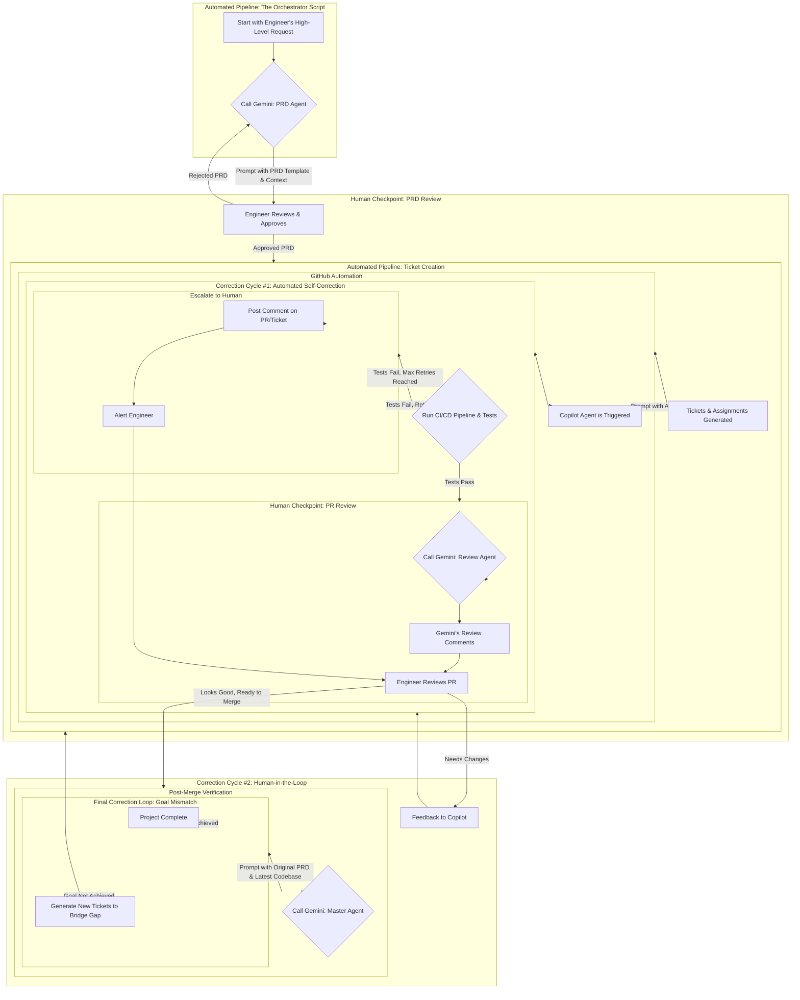

# bug-free-octo-guide
Coding Agent

```mermaid
graph TD
    subgraph A[Automated Pipeline: The Orchestrator Script]
        A1[Start with Engineer's High-Level Request] --> B{Call Gemini: PRD Agent};
    end

    subgraph C[Human Checkpoint: PRD Review]
        B --> |Prompt with PRD Template & Context| C1[Engineer Reviews & Approves];
        C1 --> |Approved PRD| D{Call Gemini: Ticket Agent};
        C1 --> |Rejected PRD| B;
    end

    subgraph D[Automated Pipeline: Ticket Creation]
        D --> |Prompt with Approved PRD| E[Tickets & Assignments Generated];
        E --> F[GitHub Issues Created & Assigned];
    end

    subgraph F[GitHub Automation]
        F --> G[Copilot Agent is Triggered];
        G --> H[Copilot's Action: Code & Test];
    end

    subgraph H[Correction Cycle #1: Automated Self-Correction]
        H --> I{Run CI/CD Pipeline & Tests};
        I --> |Tests Pass| J[Draft PR Created];
        I --> |Tests Fail, Max Retries Reached| K[Escalate to Human];
        I --> |Tests Fail, Retrying| H;
    end

    subgraph J[Human Checkpoint: PR Review]
        J --> L{Call Gemini: Review Agent};
        L --> M[Gemini's Review Comments];
        M --> N[Engineer Reviews PR];
    end

    subgraph O[Correction Cycle #2: Human-in-the-Loop]
        N --> |Needs Changes| P[Feedback to Copilot];
        P --> H;
        N --> |Looks Good, Ready to Merge| Q[PR Merged];
    end

    subgraph Q[Post-Merge Verification]
        Q --> R{Call Gemini: Master Agent};
        R --> |Prompt with Original PRD & Latest Codebase| S{Verify Goal Achievement};
    end

    subgraph S[Final Correction Loop: Goal Mismatch]
        S --> |Goal Achieved| T[Project Complete];
        S --> |Goal Not Achieved| U[Generate New Tickets to Bridge Gap];
        U --> D;
    end

    subgraph K[Escalate to Human]
        K --> K1[Post Comment on PR/Ticket];
        K1 --> K2[Alert Engineer];
        K2 --> N;
    end
```
