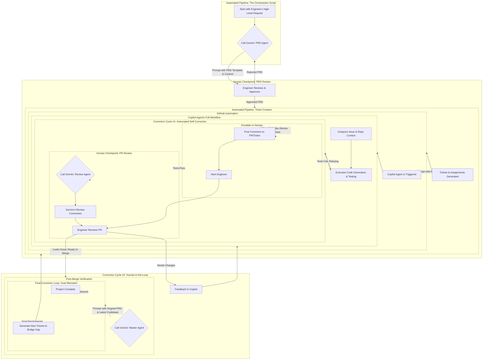

# bug-free-octo-guide
Coding Agent

This workflow transforms a high-level feature idea into a production-ready implementation, with a series of automated agents handling the majority of the work while maintaining critical human checkpoints for oversight and quality control.

## Running the Application

To run the application, you will need to start two servers in separate terminal sessions:

1.  **Backend Server (for development):**
    ```bash
    # From the project root
    venv/bin/uvicorn src.bug_free_octo_guide.main:app --reload --host 0.0.0.0
    ```
    The backend server will be available at `http://0.0.0.0:8000` and will automatically restart when code changes are detected.

2.  **Frontend Server:**
    ```bash
    # From the project root
    cd ui && npm start
    ```
    The frontend development server will be available at `http://localhost:3000` and accessible on your local network.

## Phase 1: Planning and Decomposition (The Orchestrator's First Act)
The process begins when an engineer provides a high-level request to a central orchestrator script. The orchestrator's first job is to understand the task and break it down.
- PRD Generation: The orchestrator, acting as a "Project Manager," sends a prompt to a Gemini-powered PRD Agent. This prompt contains a template of your company's tech spec document, along with a high-level feature description and any relevant context (e.g., existing models, packs). The PRD Agent's output is a detailed technical specification document.
- Human Checkpoint #1 (PRD Review): The orchestrator pauses and presents the generated PRD to the engineer for review. If the engineer approves the document, the process continues. If it's rejected, the engineer provides feedback, and the orchestrator can re-prompt the PRD Agent, initiating a correction cycle at the planning stage.
- Ticket Generation: With the approved PRD, the orchestrator prompts a Gemini-powered Ticketing Agent. This agent's task is to analyze the PRD and generate a set of structured GitHub issues, complete with titles, descriptions, and acceptance criteria.
- Automated Handoff: The orchestrator then uses the GitHub API to automatically create these tickets in your repository and assigns them to a special "copilot" user, triggering the next phase.

## Phase 2: Automated Implementation and Self-Correction (The Coding Loop)
This phase is handled by GitHub's automation, where the assigned tickets are converted into code.
- Copilot Agent is Triggered: A GitHub webhook detects the new assignment to the copilot user and triggers the GitHub Copilot Agent. The agent begins its work, using the ticket description as its primary instruction.
- Automated Verification: The agent generates code, runs local tests, and initiates a full CI/CD pipeline to verify its changes.

## Phase 3: Human Review and Finalization (The Quality Check)
Once the code is implemented and passes all automated tests, it's time for human oversight.
- Draft PR Created: After the internal tests pass, Copilot Agent creates a draft Pull Request with the implemented code and a summary of its actions.
- Code Review Agent: The orchestrator detects the new PR and calls a Gemini-powered Review Agent. This agent analyzes the code diff, the original ticket, and your company's guidelines to generate detailed review comments, which are automatically posted on the PR.
- Human Checkpoint #2 (Code Review): An engineer performs the final review of the PR, considering both the code and the agent's review comments.
- Correction Cycle #2 (Human-in-the-Loop): This is where you, the engineer, provide critical feedback.
- Detection: The engineer finds issues (e.g., architectural concerns, a bug, or non-compliance with a guideline).
- Action: The engineer leaves a comment on the PR with specific instructions for a fix. This feedback automatically re-triggers the Copilot Agent.
- Re-entry: The agent then re-enters its implementation and self-correction loop (Phase 2), with the new instructions as its guide.

## Phase 4: Final Validation (The Goal Verification Loop)
This is the ultimate check to ensure the entire feature is a success, not just the individual tickets.
- PR Merged & Trigger: After all tickets for the feature have been approved and merged, a final action (e.g., a GitHub Action on the last merge) triggers a Gemini-powered Master Agent.
- Goal Verification: This agent has a high-level view of the entire codebase and the original PRD. It asks a critical question: "Has the work from all merged tickets fully met the overall goal outlined in the PRD?" It can use tools to run end-to-end tests, analyze code changes, and compare them against the PRD's objectives.
- Correction Cycle #3 (Final Goal Mismatch):
- Detection: If the Master Agent finds a discrepancy (e.g., a feature was only partially implemented, or a key requirement was missed), it's considered a goal mismatch.
- Action: The agent's task is to analyze the gap and generate a new set of tickets specifically to address it.
- Re-entry: These new tickets are then automatically created and assigned to Copilot, sending the entire pipeline back to the implementation phase to "bridge the gap" and fully meet the original goal.


