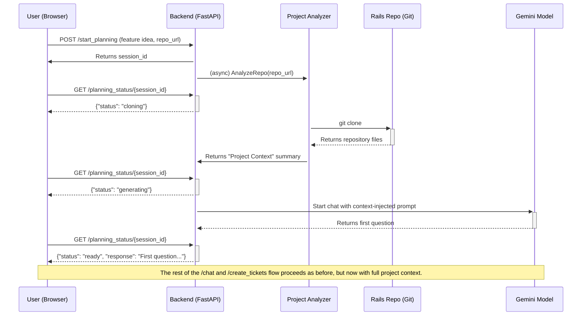

# Phase 1: Planning and Decomposition (Context-Aware)

This phase transforms a high-level feature idea into a detailed, project-specific technical specification (PRD) and a set of actionable engineering tickets. The key to this phase is a **pre-analysis step** that makes the agent context-aware, ensuring the generated PRD is grounded in the reality of the target codebase.

## Architecture

### Backend (`src` directory)

The backend is a **FastAPI** server written in Python. It manages the entire planning workflow.

1.  **`/start_planning` (New Endpoint):**
    *   This endpoint receives the user's high-level feature description and the URL of the target GitHub repository.
    *   It triggers a **Project Analyzer** process which performs a shallow `git clone` of the target repository. This is now an asynchronous background task to prevent request timeouts.
    *   It reads and summarizes key files (`db/schema.rb`, `config/routes.rb`, `Gemfile`, `conventions.md`) to build a "Project Context" summary.
    *   This context is then used to initialize the PRD generation conversation.

2.  **`/planning_status/{session_id}` (New Endpoint):**
    *   This endpoint allows the frontend to poll for the status of the planning process (`cloning`, `generating`, `ready`, `error`).

3.  **`/chat`:**
    *   This endpoint handles the interactive, multi-turn conversation for generating the PRD.
    *   Crucially, the initial prompt is injected with the "Project Context" summary, allowing the agent to ask highly relevant and specific questions about the existing application.

4.  **`/create_tickets`:**
    *   This endpoint receives the final, context-aware PRD.
    *   It uses a Gemini model to generate a list of structured engineering tickets.
    *   It then uses the `PyGithub` library to create these tickets in the target GitHub repository.
    *   *Note: This functionality has been temporarily removed from the UI to simplify the user experience and address some frontend bugs.*

5.  **PRD Artifacts:**
    *   Generated PRDs are saved to the `artifacts/prd` directory.
    *   Each PRD is saved with a unique filename that includes a timestamp and a sanitized version of the feature description (e.g., `20250806-123000-implement-dark-mode.md`).

6.  **PRD Agent Refactoring:**
    *   The `PrdAgent` has been refactored to use a tool-based approach for generating and saving PRD artifacts. This is the correct way to handle artifact saving with the Google ADK.
    *   The `generate_prd` method in the `PrdAgent` now handles the file saving logic directly.
    *   The `/chat` endpoint in `main.py` has been updated to correctly call the `PrdAgent` with the new tool-based approach.

### Frontend (`ui` directory)

The frontend is a **React** and **TypeScript** application styled with **Tailwind CSS**.

*   It provides an initial form to capture the feature idea and target repository URL. The repository input has been changed from a dropdown to a simple text field.
*   After the backend completes its analysis, the UI transitions to the familiar chat interface for the collaborative PRD creation process. The UI now polls the `/planning_status` endpoint and displays the status to the user, enabling a non-blocking user experience.
*   Finally, it provides a mechanism to approve the PRD and trigger the ticket creation.

## Interaction Flow

The following diagram illustrates the updated, context-aware workflow:

## Next Steps

The immediate next step is to implement this new architecture, starting with the UI changes to collect the repository URL upfront.

## Proposed Architecture: Nested Planners

The workflow described in the project's main `README.md` is not a single, linear process, but a series of nested loops and correction cycles. To model this complex, multi-phase workflow effectively within the `google-adk` framework, a nested planner architecture is proposed.

A single, monolithic planner would become incredibly complex and difficult to manage. By breaking the problem down into a hierarchy of planners, we gain several advantages:

*   **Modularity and Separation of Concerns:** Each planner can be responsible for a single phase or loop (e.g., `PrdPlanner`, `ImplementationPlanner`, `ValidationPlanner`). This makes the code cleaner, easier to understand, and simpler to debug.
*   **Mirrors the Architecture:** The code structure will directly mirror the logical flow shown in the diagram, making the implementation intuitive.
*   **State Management:** Each planner can manage the state relevant to its specific phase, without needing to be aware of the entire application's state.
*   **Reusability:** A well-defined `ImplementationPlanner` could potentially be reused for different features or even in other projects.

### Planner Hierarchy

Here is how the application could be structured using nested planners, directly mapping to the documented phases:

1.  **`MasterPlanner` (The Top-Level Orchestrator):** This would be the main planner for the root agent. Its job is to execute the major phases of the project.
    *   **Step 1:** Execute the `PrdPlanner`.
    *   **Step 2:** Execute the `ImplementationPlanner` (which would handle the loop of all tickets).
    *   **Step 3:** Execute the `ValidationPlanner`.
    *   **Step 4:** (Conditional) If validation fails, loop back to Step 2 with new tickets.

2.  **`PrdPlanner`:** This is what we've already started building. It would be invoked by the `MasterPlanner`.
    *   **Step 1:** `ClarificationAgent`
    *   **Step 2:** `UserStoryAgent`
    *   **Step 3:** `TechSpecAgent`
    *   **Step 4:** `PrdDraftAgent`
    *   **Step 5:** Human Checkpoint (pausing for approval before the `MasterPlanner` continues).

3.  **`ImplementationPlanner`:** This planner would manage the entire coding and review process for a set of tickets.
    *   **Step 1:** For each ticket, invoke a `CodingAgent` (the "Copilot Agent"). This agent would have its own internal self-correction loop.
    *   **Step 2:** After the `CodingAgent` succeeds, invoke a `ReviewAgent`.
    *   **Step 3:** Pause for the Human Checkpoint (the PR review). If feedback is given, this planner would loop back to Step 1 for that ticket.

4.  **`ValidationPlanner`:** This planner would handle the final goal verification.
    *   **Step 1:** Invoke a `GoalVerificationAgent` (the "Master Agent").
    *   **Step 2:** Based on the output, either signal completion or generate new tickets for the `MasterPlanner` to loop with.

This structure creates a powerful, scalable, and maintainable agent that accurately reflects the sophisticated workflow designed for this project.
