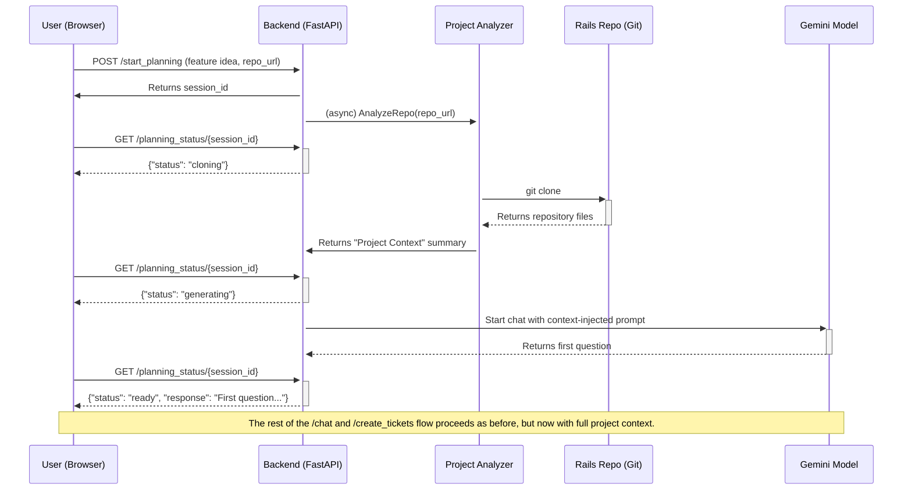

# Phase 1: Planning and Decomposition (Context-Aware)

This phase transforms a high-level feature idea into a detailed, project-specific technical specification (PRD) and a set of actionable engineering tickets. The key to this phase is a **pre-analysis step** that makes the agent context-aware, ensuring the generated PRD is grounded in the reality of the target codebase.

## Architecture

### Backend (`src` directory)

The backend is a **FastAPI** server written in Python. It manages the entire planning workflow.

1.  **`/start_planning` (New Endpoint):**
    *   This endpoint receives the user's high-level feature description and the URL of the target GitHub repository.
    *   It triggers a **Project Analyzer** process which performs a shallow `git clone` of the target repository. This is now an asynchronous background task to prevent request timeouts.
    *   It reads and summarizes key files (`db/schema.rb`, `config/routes.rb`, `Gemfile`, `conventions.md`) to build a "Project Context" summary.
    *   This context is then used to initialize the PRD generation conversation.

2.  **`/planning_status/{session_id}` (New Endpoint):**
    *   This endpoint allows the frontend to poll for the status of the planning process (`cloning`, `generating`, `ready`, `error`).

3.  **`/chat`:**
    *   This endpoint handles the interactive, multi-turn conversation for generating the PRD.
    *   Crucially, the initial prompt is injected with the "Project Context" summary, allowing the agent to ask highly relevant and specific questions about the existing application.

4.  **`/create_tickets`:**
    *   This endpoint receives the final, context-aware PRD.
    *   It uses a Gemini model to generate a list of structured engineering tickets.
    *   It then uses the `PyGithub` library to create these tickets in the target GitHub repository.
    *   *Note: This functionality has been temporarily removed from the UI to simplify the user experience and address some frontend bugs.*

### Frontend (`ui` directory)

The frontend is a **React** and **TypeScript** application styled with **Tailwind CSS**.

*   It provides an initial form to capture the feature idea and target repository URL. The repository input has been changed from a dropdown to a simple text field.
*   After the backend completes its analysis, the UI transitions to the familiar chat interface for the collaborative PRD creation process. The UI now polls the `/planning_status` endpoint and displays the status to the user, enabling a non-blocking user experience.
*   Finally, it provides a mechanism to approve the PRD and trigger the ticket creation.

## Interaction Flow

The following diagram illustrates the updated, context-aware workflow:

## Next Steps

The immediate next step is to implement this new architecture, starting with the UI changes to collect the repository URL upfront.
