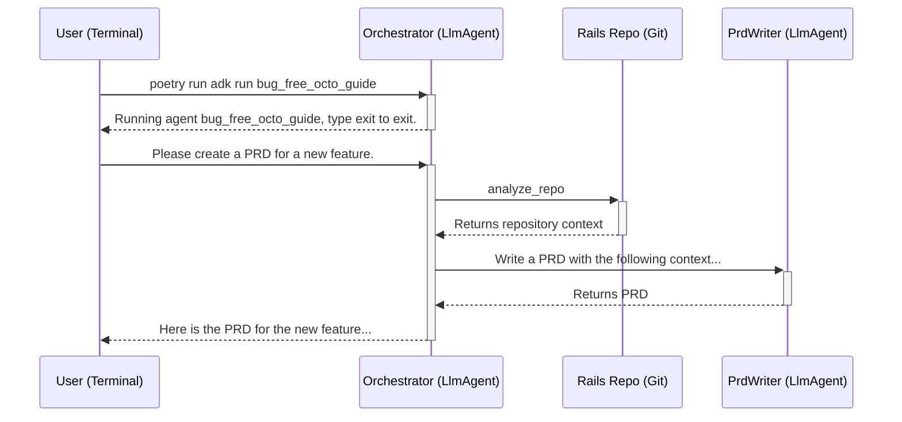

# Phase 1: A Hierarchical Agent for PRD Generation

This phase focuses on creating a robust, hierarchical agent that can analyze a remote Git repository and generate a Product Requirements Document (PRD).

## Architecture

The project is a command-line application built using the **Google Agent Development Kit (ADK)** in Python. It is designed to be run interactively from the terminal.

The agent follows a hierarchical architecture, with a central orchestrator agent that delegates tasks to specialized sub-agents and tools.

1.  **`bug_free_octo_guide` (Orchestrator Agent):**
    *   This is the core of the application, defined as an `LlmAgent` within the ADK framework.
    *   It acts as a "Project Manager," responsible for orchestrating the PRD generation process.
    *   It is invoked by running `poetry run adk run bug_free_octo_guide` from the project root.

2.  **Sub-Agents and Tools:**
    *   **`analyze_repo` (Tool):** A Python function that takes a GitHub repository URL as input, clones the repository, and summarizes key files to provide project context.
    *   **`PrdWriterAgent` (Sub-Agent):** An `LlmAgent` wrapped in an `AgentTool`. Its sole responsibility is to write the PRD based on the user's request and the context provided by the `analyze_repo` tool.

## Interaction Flow

The user interacts with the agent directly through the command line.

## Testing

The project has adopted a robust, end-to-end testing strategy using the `InMemoryRunner` provided by the `google-adk` library.

*   **`pytest` and `pytest-asyncio`:** Tests are written using the `pytest` framework and the `pytest-asyncio` plugin for handling asynchronous code.
*   **`InMemoryRunner`:** The tests use the `InMemoryRunner` to run the agent in memory, exactly as it would run in a production environment.
*   **Behavioral Assertions:** The tests make assertions about the agent's output to verify its behavior, such as ensuring that it asks for clarification when given a vague prompt.

This method provides reliable verification of the agent's complete functionality and aligns with the best practices demonstrated in the `adk-samples` repository.

## Next Steps: Expanding the Hierarchy

The next phase of development will focus on expanding the hierarchy of sub-agents to create a more detailed and comprehensive PRD.

*   **`ClarificationAgent`**: A conversational agent for user dialogue.
*   **`UserStoryAgent`**: A specialized agent for generating user stories.
*   **`TechSpecAgent`**: A specialized agent for generating technical specifications.