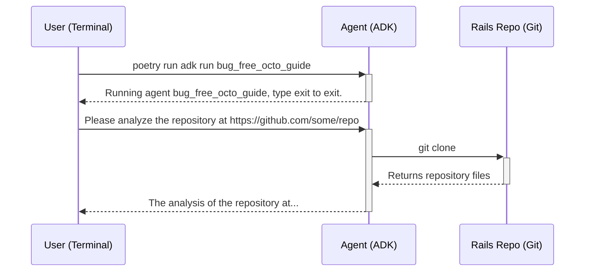

# Phase 1: Command-Line Context Analysis

This phase transforms a high-level feature idea into a detailed, project-specific technical specification (PRD) and a set of actionable engineering tickets. The key to this phase is a **pre-analysis step** that makes the agent context-aware, ensuring the generated PRD is grounded in the reality of the target codebase.

## Architecture

The project is a command-line application built using the **Google Agent Development Kit (ADK)** in Python. It is designed to be run interactively from the terminal.

1.  **`bug_free_octo_guide` (ADK Agent):**
    *   This is the core of the application, defined as a tool-based agent within the ADK framework.
    *   It is invoked by running `poetry run adk run bug_free_octo_guide` from the project root.

2.  **`analyze_repo` (Tool):**
    *   The agent's primary tool is `analyze_repo`, a Python function that takes a GitHub repository URL as input.
    *   It performs a shallow `git clone` of the target repository into a temporary directory.
    *   It then reads key files (`db/schema.rb`, `config/routes.rb`, `Gemfile`, `conventions.md`) to build a "Project Context" summary.
    *   The agent uses this summary to inform its responses.

## Interaction Flow

The user interacts with the agent directly through the command line.

## Testing

Due to limitations discovered in the `google-adk` library regarding the programmatic import and instantiation of its core components (`Planner`, `Agent`), a traditional unit testing approach was not feasible.

The project has instead adopted a robust, end-to-end testing strategy:

*   **`pytest` and `subprocess`:** Tests are written using the `pytest` framework.
*   **End-to-End Verification:** The tests use Python's `subprocess` module to run the agent as a separate process, exactly as a user would.
*   **Automated I/O:** The test script provides input to the agent's `stdin` and captures the output from its `stdout` and `stderr`.
*   **Behavioral Assertions:** The test then makes assertions about the agent's output to verify its behavior, ensuring the `analyze_repo` tool is called correctly and produces the expected results.

This method provides reliable verification of the agent's complete functionality.

## Next Steps

The immediate next step is to build upon this foundation. Now that the context analysis is working and tested, we will proceed with implementing the PRD and ticket generation capabilities as described in the project's main `README.md`.