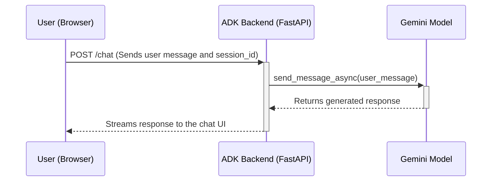

# Phase 1: Planning and Decomposition

This phase takes a high-level feature idea from the user and transforms it into a detailed technical specification (PRD) and a set of actionable engineering tickets. The process is managed by a FastAPI backend and a React-based web interface.

## Architecture

### Backend (`src` directory)

The backend is a **FastAPI** server written in Python. It exposes two main endpoints:

1.  `/chat`: This endpoint handles the interactive, multi-turn conversation for generating the PRD. It uses the `google-generativeai` library to communicate with the Gemini model and maintains the conversation state using a session ID.
2.  `/create_tickets`: This endpoint receives the final PRD content, uses a Gemini model to generate a list of structured engineering tickets, and then uses the `PyGithub` library to create those tickets in a specified GitHub repository.

### Frontend (`ui` directory)

The frontend is a modern chat interface built with **React** and **TypeScript**, and styled with **Tailwind CSS**. It provides a user-friendly way to interact with the PRD Agent and will be extended to trigger the ticket creation process.

### Environment Configuration

The application requires a `.env` file in the project root with the following variables:

```
GEMINI_API_KEY=your_gemini_api_key
GITHUB_TOKEN=your_github_personal_access_token
GITHUB_REPO=your_github_username/repository_name
```

## Interaction Flow

The following diagram illustrates the flow for a single turn in the PRD generation conversation:



## Next Steps

-   **Frontend Ticket Creation:** Add a button or command in the UI to send the generated PRD to the `/create_tickets` endpoint.
-   **Human-in-the-Loop:** Implement the human checkpoint for PRD review and approval within the UI before creating tickets.
-   **Error Handling:** Improve error handling and user feedback in both the frontend and backend.