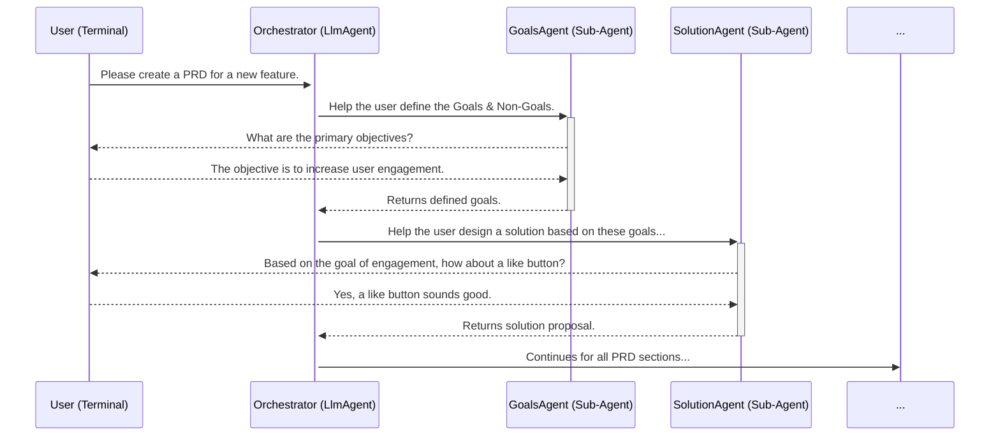

# Phase 1: A Hierarchical Agent for Collaborative PRD Generation

This phase focuses on creating a robust, hierarchical agent that collaboratively generates a Product Requirements Document (PRD) by guiding a user through a series of structured sections, based on the detailed process outlined in `prdprompt.md`.

## Architecture

The project is a command-line application built using the **Google Agent Development Kit (ADK)** in Python. It follows a hierarchical, multi-agent architecture where a central orchestrator delegates tasks to specialized sub-agents.

1.  **`PrdOrchestratorAgent` (Orchestrator):**
    *   This is the core of the application, defined as an `LlmAgent`.
    *   It acts as a "Tech Lead," responsible for orchestrating the PRD generation process by invoking a series of specialized sub-agents in the correct order.
    *   It is invoked by running `poetry run adk run bug_free_octo_guide` from the project root.

2.  **Specialized Sub-Agents (The Team):**
    *   Instead of a single monolithic PRD writer, the orchestrator uses a suite of focused sub-agents, each responsible for a specific section of the PRD as defined in `prdprompt.md`.
    *   Each sub-agent is an `LlmAgent` wrapped in an `AgentTool`, allowing the orchestrator to delegate tasks.
    *   This modular approach allows for highly specific prompting and logic for each part of the PRD creation process.

## Interaction Flow

The user interacts with the orchestrator, which in turn manages the conversation with the various sub-agents to build the PRD section by section.

## Testing

The project uses the `InMemoryRunner` provided by the `google-adk` library for robust end-to-end testing.

*   **`pytest` and `pytest-asyncio`:** Tests are written using the `pytest` framework.
*   **`InMemoryRunner`:** Tests run the agent in a realistic, in-memory environment.
*   **Behavioral Assertions:** Tests verify the agent's behavior, such as its ability to ask appropriate clarifying questions for each PRD section, rather than asserting on exact string outputs.

## Next Steps: Implementing the Sub-Agent Hierarchy

The immediate plan is to build out the sub-agent hierarchy, starting with the first interactive step in the PRD process.

1.  **`GoalsAgent`**: The first sub-agent to be implemented. It will be responsible for collaborating with the user to define the "Goals & Non-Goals" of the feature.
2.  **Further Sub-Agents**: Subsequent agents, such as `SolutionProposalAgent`, `ApiChangesAgent`, and `TestingStrategyAgent`, will be implemented to handle the remaining sections of the PRD, each one building on the context gathered by the previous agents.
