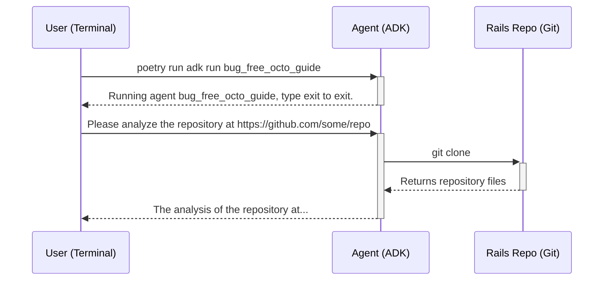

# Phase 1: A Tool-Based Agent for Context Analysis

This phase focuses on creating a robust, tool-based agent that can analyze a remote Git repository to provide context for future development tasks.

## Architecture

The project is a command-line application built using the **Google Agent Development Kit (ADK)** in Python. It is designed to be run interactively from the terminal.

1.  **`bug_free_octo_guide` (ADK Agent):**
    *   This is the core of the application, defined as a tool-based agent within the ADK framework.
    *   It is invoked by running `poetry run adk run bug_free_octo_guide` from the project root.

2.  **`analyze_repo` (Tool):**
    *   The agent's primary tool is `analyze_repo`, a Python function that takes a GitHub repository URL as input.
    *   It performs a shallow `git clone` of the target repository into a temporary directory.
    *   It then reads key files (`db/schema.rb`, `config/routes.rb`, `Gemfile`, `conventions.md`) to build a "Project Context" summary.
    *   The agent uses this summary to inform its responses.

## Interaction Flow

The user interacts with the agent directly through the command line.

## Testing

Due to limitations discovered in the `google-adk` library regarding the programmatic import and instantiation of its core components, a traditional unit testing approach was not feasible.

The project has instead adopted a robust, end-to-end testing strategy:

*   **`pytest` and `subprocess`:** Tests are written using the `pytest` framework.
*   **End-to-End Verification:** The tests use Python's `subprocess` module to run the agent as a separate process, exactly as a user would.
*   **Automated I/O:** The test script provides input to the agent's `stdin` and captures the output from its `stdout`.
*   **Behavioral Assertions:** The test then makes assertions about the agent's output to verify its behavior.

This method provides reliable verification of the agent's complete functionality.

## Next Steps: A Hierarchical Agent Architecture

The next phase of development will focus on building a more sophisticated, multi-agent system based on a hierarchy of planners and specialized agents. This will allow us to tackle the more complex tasks of PRD generation and code implementation.

### 1. Phase: PRD & Planning
**Oversight Agent: `PrdOrchestratorAgent`**
This agent will be the "Product Manager" of the team. Its sole responsibility is to oversee the creation of a high-quality, context-aware Product Requirements Document (PRD).

*   **Agent Type:** **Planner-based Agent**.
*   **Sub-Agents / Tools:**
    *   **`ContextAnalysisTool`**: Our existing `analyze_repo` function.
    *   **`ClarificationAgent`**: A conversational agent for user dialogue.
    *   **`UserStoryAgent`**: A specialized agent for generating user stories.
    *   **`TechSpecAgent`**: A specialized agent for generating technical specifications.
    *   **`PrdWriterAgent`**: An agent for formatting the final PRD.

### 2. Phase: Implementation
**Oversight Agent: `ImplementationOrchestratorAgent`**
This agent will act as the "Engineering Manager" or "Tech Lead." It will take the list of tickets from the PRD phase and ensure each one is implemented correctly.

*   **Agent Type:** **Planner-based Agent**.
*   **Sub-Agents / Tools:**
    *   **`CodingAgent`**: The "Software Engineer" agent (a powerful Tool-based ReAct Agent).
    *   **`ReviewAgent`**: The "Code Reviewer" agent.
    *   **`HumanCheckpointTool`**: A tool to pause for user approval.

### 3. Phase: Validation
**Oversight Agent: `ValidationOrchestratorAgent`**
This agent will be the "Quality Assurance" lead. Its job is to verify that the implemented code meets the original high-level goal.

*   **Agent Type:** **Tool-based Agent**.
*   **Tools:**
    *   **`TestExecutionTool`**: A tool to run the target application's test suite.
    *   **`GoalVerificationAgent`**: A final agent to verify that the implementation satisfies the user's request.

This hierarchical structure will provide a robust and scalable foundation for the project's future development.
