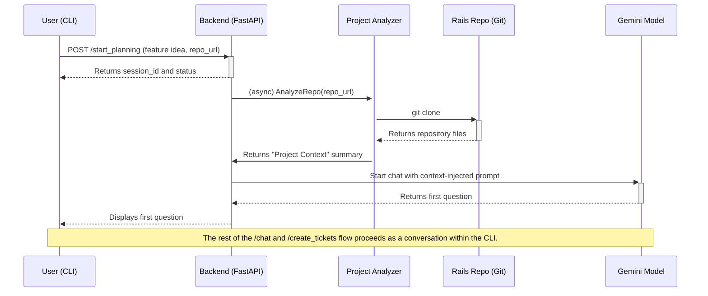

# Phase 1: Planning and Decomposition (Context-Aware)

This phase transforms a high-level feature idea into a detailed, project-specific technical specification (PRD) and a set of actionable engineering tickets. The key to this phase is a **pre-analysis step** that makes the agent context-aware, ensuring the generated PRD is grounded in the reality of the target codebase.

## Architecture

### Backend (`src` directory)

The backend is a **FastAPI** server written in Python. It manages the entire planning workflow.

1.  **`/start_planning` (New Endpoint):**
    *   This endpoint receives the user's high-level feature description and the URL of the target GitHub repository.
    *   It triggers a **Project Analyzer** process which performs a shallow `git clone` of the target repository. This is now an asynchronous background task to prevent request timeouts.
    *   It reads and summarizes key files (`db/schema.rb`, `config/routes.rb`, `Gemfile`, `conventions.md`) to build a "Project Context" summary.
    *   This context is then used to initialize the PRD generation conversation.

2.  **`/planning_status/{session_id}` (New Endpoint):**
    *   This endpoint allows the frontend to poll for the status of the planning process (`cloning`, `generating`, `ready`, `error`).

3.  **`/chat`:**
    *   This endpoint handles the interactive, multi-turn conversation for generating the PRD.
    *   Crucially, the initial prompt is injected with the "Project Context" summary, allowing the agent to ask highly relevant and specific questions about the existing application.

4.  **`/create_tickets`:**
    *   This endpoint receives the final, context-aware PRD.
    *   It uses a Gemini model to generate a list of structured engineering tickets.
    *   It then uses the `PyGithub` library to create these tickets in the target GitHub repository.
    *   *Note: This functionality has been temporarily removed from the UI to simplify the user experience and address some frontend bugs.*

5.  **PRD Artifacts:**
    *   Generated PRDs are saved to the `artifacts/prd` directory.
    *   Each PRD is saved with a unique filename that includes a timestamp and a sanitized version of the feature description (e.g., `20250806-123000-implement-dark-mode.md`).

6.  **PRD Agent Refactoring:**
    *   The `PrdAgent` has been refactored to use a tool-based approach for generating and saving PRD artifacts. This is the correct way to handle artifact saving with the Google ADK.
    *   The `generate_prd` method in the `PrdAgent` now handles the file saving logic directly.
    *   The `/chat` endpoint in `main.py` has been updated to correctly call the `PrdAgent` with the new tool-based approach.

### Frontend (Google ADK)

The user interacts with the system through the command-line interface provided by the Google Agent Development Kit (ADK). There is no separate React-based frontend; all interactions, from providing the initial feature idea to the collaborative PRD creation, are handled via the ADK's conversational CLI.

## Interaction Flow

The following diagram illustrates the updated, context-aware workflow:

```mermaid
sequenceDiagram
    participant User (CLI)
    participant Backend (FastAPI)
    participant Project Analyzer
    participant Rails Repo (Git)
    participant Gemini Model

    User (CLI)->>+Backend (FastAPI): POST /start_planning (feature idea, repo_url)
    Backend (FastAPI)-->>-User (CLI): Returns session_id and status
    Backend (FastAPI)->>+Project Analyzer: (async) AnalyzeRepo(repo_url)

    Project Analyzer->>+Rails Repo (Git): git clone
    Rails Repo (Git)-->>-Project Analyzer: Returns repository files
    Project Analyzer->>Backend (FastAPI): Returns "Project Context" summary

    Backend (FastAPI)->>+Gemini Model: Start chat with context-injected prompt
    Gemini Model-->>-Backend (FastAPI): Returns first question
    Backend (FastAPI)-->>User (CLI): Displays first question

    Note over User (CLI), Gemini Model: The rest of the /chat and /create_tickets flow proceeds as a conversation within the CLI.
```

## Next Steps

The immediate next step is to implement this new architecture, starting with the backend changes to collect the repository URL and perform the context analysis.
